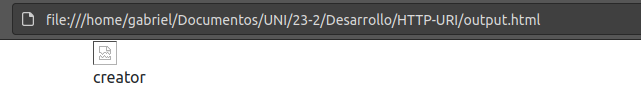
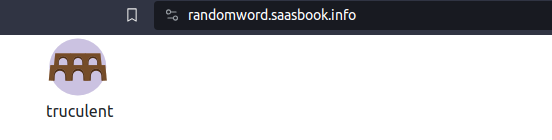
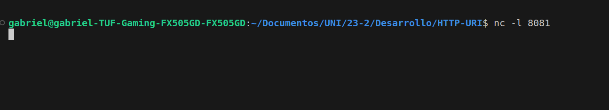
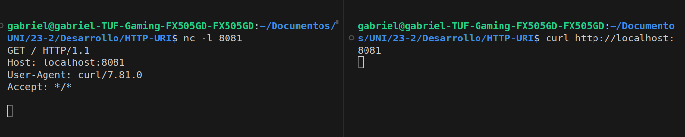

# HTTP-URI

Comando de prueba : `curl 'http://randomword.saasbook.info'`.

Genera en la terminal:

```html
<!DOCTYPE html>
<html lang="en">
  <head>
    <meta charset="utf-8">
    <link href="https://cdn.jsdelivr.net/npm/bootstrap@5.0.0-beta1/dist/css/bootstrap.min.css" rel="stylesheet" integrity="sha384-giJF6kkoqNQ00vy+HMDP7azOuL0xtbfIcaT9wjKHr8RbDVddVHyTfAAsrekwKmP1" crossorigin="anonymous">
    <title>Random Word Generator</title>
  <body class="container">
    <div id="image">
      
    </div>
    <div id="word">
      simplistic
    </div>
  </body>
</html>
```

**Pregunta:¿Cuáles son las dos diferencias principales que has visto anteriormente y lo que ves en un navegador web 'normal'? ¿Qué explica estas diferencias?**

Lo que se ve anteriormente:



Lo que se ve en un navegador normal:



La diferencia principal es que ,el navegador muestra la palabra aleatoria y una imagen relacionada, mientras que con `curl` podremos ver texto plano, sin ningun tipo de formato.
Para simular el servidor usamos el comando `nc -l 8081`.

Veremos que la shell queda en espera.



**Pregunta: Suponiendo que estás ejecutando curl desde otro shell ¿qué URL tendrás que pasarle a curl para intentar acceder a tu servidor falso y por qué?**

Como estamos inicialiando un servidor en local, nuestra ruta es `http://localhost:8081`, por lo que la instrucción curl es : `curl http://localhost:8081`.

Ahora abrimos otra terminal o shell e interactuamos con el servidor.



Vemos la siguiente salida:

```txt
GET / HTTP/1.1
Host: localhost:8081
User-Agent: curl/7.81.0
Accept: */*
```

**Pregunta: La primera línea de la solicitud identifica qué URL desea recuperar el cliente. ¿Por qué no ves `http://localhost:8081` en ninguna parte de esa línea?**

La salida mostrada anteriormente contiene la informacion del link, vemos `/ HTTP/1.1 y host: localhost:8081`.

**Pregunta: Según los encabezados del servidor, ¿cuál es el código de respuesta HTTP del servidor que indica el estado de la solicitud del cliente y qué versión del protocolo HTTP utilizó el servidor para responder al cliente?**

Después de ejecutar el comando `curl -i 'http://randomword.saasbook.info'`, tendremos la siguiente salida:

```html
HTTP/1.1 200 OK 
Connection: keep-alive
Content-Type: text/html;charset=utf-8
Content-Length: 480
X-Xss-Protection: 1; mode=block
X-Content-Type-Options: nosniff
X-Frame-Options: SAMEORIGIN
Server: WEBrick/1.4.2 (Ruby/2.6.6/2020-03-31)
Date: Wed, 13 Dec 2023 03:00:33 GMT
Via: 1.1 vegur

<!DOCTYPE html>
<html lang="en">
  <head>
    <meta charset="utf-8">
    <link href="https://cdn.jsdelivr.net/npm/bootstrap@5.0.0-beta1/dist/css/bootstrap.min.css" rel="stylesheet" integrity="sha384-giJF6kkoqNQ00vy+HMDP7azOuL0xtbfIcaT9wjKHr8RbDVddVHyTfAAsrekwKmP1" crossorigin="anonymous">
    <title>Random Word Generator</title>
  <body class="container">
    <div id="image">
      
    </div>
    <div id="word">
      spotty
    </div>
  </body>
</html>
```

El código de respuesta del servidor es `200` y la versión del protocolo es `HTTP/1.1.`

**Pregunta: Cualquier solicitud web determinada puede devolver una página HTML, una imagen u otros tipos de entidades. ¿Hay algo en los encabezados que crea que le dice al cliente cómo interpretar el resultado?**

El encabezado cuenta con una linea llamada `Content-Type:text/html`, significa que el cuerpo del mensaje contiene código html.

## ¿Qué sucede cuando falla un HTTP request?

**Pregunta: ¿Cuál sería el código de respuesta del servidor si intentaras buscar una URL inexistente en el sitio generador de palabras aleatorias?**

Cuando generamos una respuesta de un link inexistente veremos lo siguiente:

```text
HTTP/1.1 404 Not Found 
Connection: keep-alive
X-Cascade: pass
Content-Type: text/html;charset=utf-8
Content-Length: 12
X-Xss-Protection: 1; mode=block
X-Content-Type-Options: nosniff
X-Frame-Options: SAMEORIGIN
Server: WEBrick/1.4.2 (Ruby/2.6.6/2020-03-31)
Date: Wed, 13 Dec 2023 03:15:29 GMT
Via: 1.1 vegur
```

Vemos la primera línea `HTTP/1.1 404 Not Found`, es decir, no se encontro la palabra en el enlace.

## ¿Qué es un cuerpo de Request?

Seguimos los pasos:
Ejecutamos `nc -l 8081`.

**Pregunta: Cuando se envía un formulario HTML, se genera una solicitud HTTP POST desde el navegador. Para llegar a tu servidor falso, ¿con qué URL deberías reemplazar Url-servidor-falso en el archivo anterior?**

